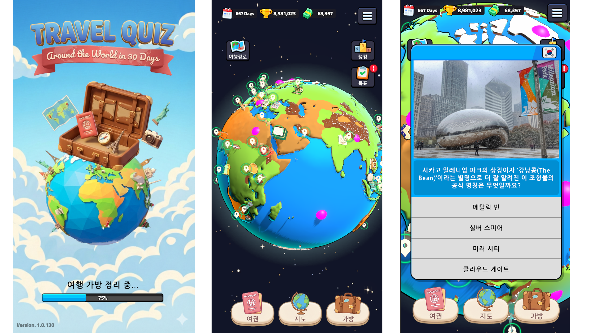

[▶ 플레이 영상 보기](https://youtu.be/rprUWd6ELEs?si=Sp62UJCfiFvNMaMB)


# Travel Quiz — 세계 여행 퀴즈 게임 (클라이언트)

지구본을 돌려 도시로 여행하며 퀴즈를 풀고, 여권/스탬프/유물을 모으는 세계 여행 컨셉의 하이퍼 캐주얼 모바일 게임 클라이언트입니다.
Unity 클라이언트에서 자체 REST API 서버와 통신하며 동작합니다.

> 엑스투알(X2R) 현장실습 인턴 기간 중 개발한 베타 버전 프로젝트입니다.
> 이 저장소에는 클라이언트 스크립트(`Scripts/`)만 포함되어 있으며, Unity 프로젝트 전체(씬/프리팹 리소스/서버 소스)는 포함되어 있지 않습니다.

## 기술 스택

| 분류 | 내용 |
|---|---|
| 클라이언트 | C#, Unity Engine |
| 리소스 관리 | Addressables (원격 리소스 다운로드/패치) |
| 통신 | `UnityWebRequest` 기반 REST API 클라이언트, JSON(JsonUtility) |
| 인증 | Google Sign-In 연동 |
| 서버 연동 | 자체 REST API 서버 (`/server/status`, `/users/trylogin`, `/player_data/*`, `/game/ranking/*` 등) — 서버 자체는 별도 저장소 |
| 에디터 툴링 | Unity `AssetPostprocessor` 기반 CSV → ScriptableObject 자동 변환기 |

## 핵심 구현 내용

### 1. ScriptableObject 기반 이벤트 드리븐 아키텍처

`EventChannelBaseSO`를 상속한 타입별 이벤트 채널(`VoidEventChannelSO`, `IntEventChannelSO`, `GameStateEventChannelSO` 등)과 `Listener` 컴포넌트로 모듈 간 직접 참조 없이 통신합니다. `ManagersBootstraper`가 `ManagerSO` 목록을 초기화/해제하며 매니저들의 생명주기를 관리합니다. ([SOEventSystem](Scripts/Script/Core/SOEventSystem), [ManagersBootstraper.cs](Scripts/Script/Core/ManagersBootstraper.cs))

### 2. Task 리스트 기반 순차 비동기 초기화

`LoadingSceneController`가 서버 상태 확인 → 최신 버전 확인 → 구글 로그인 → 리소스 다운로드 → 데이터 로드 순서를 `ITask` 인터페이스 리스트로 정의하고, 각 단계를 `await`로 순차 실행합니다. 한 단계라도 실패하면 즉시 중단하고 팝업 후 종료합니다. ([LoadingSceneController.cs](Scripts/Script/Core/SceneControll/LoadingSceneController.cs), [SceneControll](Scripts/Script/Core/SceneControll))

### 3. CSV → ScriptableObject 자동 임포터

기획 CSV 파일(`PlaceQuizData.csv`, `MissionData.csv` 등)이 변경되면 `AssetPostprocessor.OnPostprocessAllAssets`가 이를 감지해 `PlaceDataSO`, `MissionDataSO`, `EventDataSO`, `CardDataSO` 등 종류별 에셋을 자동 생성/갱신합니다. ([DataAutoImporter.cs](Scripts/Script/Editor/DataAutoImporter.cs))

### 4. LinkedList 기반 가상화 재사용 스크롤 뷰

`MissionPanelController`가 `LinkedList<MissionSlot>`으로 고정 개수(11개)의 슬롯만 생성해 재사용합니다. 스크롤 시 맨 앞/뒤 슬롯을 반대쪽으로 옮기는 방식(`RemoveFirst`/`AddLast`)으로 O(1) 재배치를 수행하며, 정렬 버튼 클릭 시 보상 가능 → 진행 중 → 완료 순으로 미션을 재정렬합니다. ([MissionPanelController.cs](Scripts/Script/UI/Mission/MissionPanelController.cs))

### 5. 회전하는 지구본 위의 비행 경로 연출

`AirplaneController`가 코루틴으로 두 지점 사이를 구면 보간(Slerp)과 포물선 높이로 이동시키면서, `LineRenderer`를 지구본(`planetCenter`)의 자식으로 붙이고 **로컬 좌표(`useWorldSpace = false`)** 로 궤적을 그립니다. 지구본의 자식이므로 지구가 회전해도 궤적이 별도 갱신 없이 함께 회전합니다. 도착 후에는 `PlaneTrailFader`가 궤적 점을 꼬리부터 순차적으로 지워가며 사라지는 연출을 담당합니다. ([AirplaneController.cs](Scripts/Script/Game/AirplaneController.cs), [PlaneTrailFader.cs](Scripts/Script/Game/PlaneTrailFader.cs))

### 6. 전략 패턴 기반 이벤트/미니게임 처리

여행 중 발생하는 이벤트(위험/행운/유물/실패 등)를 `MiniGameActionStrategy`를 상속한 SO(`DangerActionStrategy`, `LuckActionStrategy`, `ArtifactActionStrategy` 등)로 분리해, 타입 추가 시 분기문 수정 없이 새 전략 에셋만 추가하면 되도록 구현했습니다. ([MiniGameActionStrategy](Scripts/Script/Game/MiniGameActionStrategy))

## 프로젝트 구조

```
Scripts/Script
├─ Core
│  ├─ SOEventSystem   # 이벤트 채널/리스너 (SO 기반 이벤트 드리븐 아키텍처)
│  ├─ SceneControll   # ITask 기반 초기화 시퀀스 (로그인/버전체크/리소스 다운로드 등)
│  └─ Server          # WebRequestManager, API 엔드포인트 정의
├─ Data               # SO 데이터 정의, DTO, Repository
├─ Editor             # CSVReader, DataAutoImporter (CSV → SO 자동 변환)
├─ Game               # 여행/비행 연출, 미니게임, 전략 패턴 이벤트 처리
├─ UI                 # 미션/여권/유물 패널, 가상화 스크롤, 팝업
└─ Util               # 설정 로더, 로그, JSON 헬퍼
```

## 문제 해결

1. 클라이언트 초기화 시 각 모듈(서버 확인, 로그인, 리소스 다운로드 등)의 순서가 정립되지 않아 디버그가 어려웠던 문제를, `ITask` 인터페이스 리스트로 초기화 단계를 정의하고 순차적으로 `await` 실행하는 단일 컨트롤러로 해결했습니다.
2. 지구본 자체가 회전하는 구조에서 비행 경로선이 지구 회전을 따라가지 못하고 어긋나는 문제를, `LineRenderer`를 지구본의 자식 오브젝트로 두고 월드 좌표가 아닌 로컬 좌표로 경로를 기록하는 방식으로 해결해, 지구가 회전해도 궤적이 별도 계산 없이 함께 회전하도록 만들었습니다.
3. 많은 미션 데이터를 스크롤 리스트로 표시할 때 발생하는 성능 저하 문제를, `LinkedList`로 고정 개수(11개)의 슬롯만 유지하며 스크롤에 따라 앞/뒤 슬롯을 재사용하는 가상화 스크롤 뷰로 해결했습니다.

## 구현한 것

1. `ITask` 기반 순차 비동기 초기화 시퀀스와, 자체 REST API 서버(구글 로그인 연동, Addressables 리소스 다운로드 포함)와 통신하는 클라이언트 네트워크 레이어를 구현했습니다.
2. 기획 CSV 변경을 자동 감지해 ScriptableObject 데이터로 변환하는 에디터 임포터와, 모듈 간 결합도를 낮추는 SO 기반 이벤트 채널/리스너 아키텍처를 구현했습니다.
3. `LinkedList` 기반 가상화 재사용 스크롤 뷰(미션 패널)와, 지구본에 종속된 로컬 좌표 `LineRenderer`로 비행 경로를 그리고 꼬리부터 지워가며 사라지는 연출을 구현했습니다.